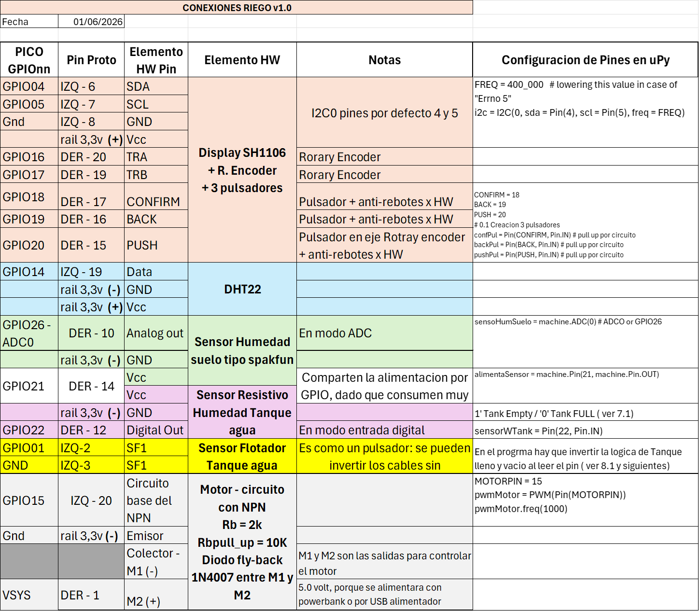
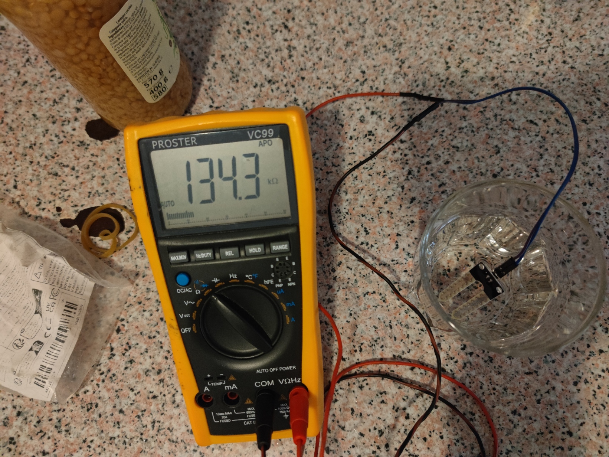
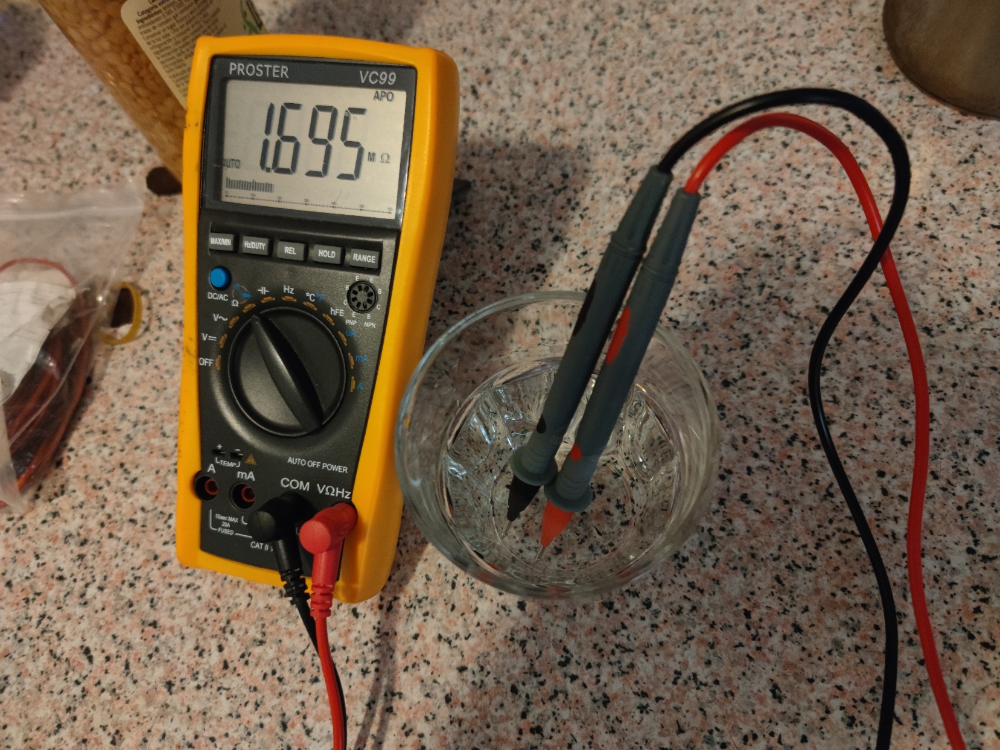
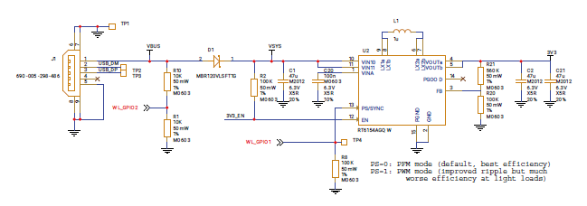

# 2526CL13_Riego_offline v1 - ~~borrador i~~

Clase 13- Prototipo de Riego automático off line v1

Indice evolutivo del las clases del taller + libros y webs de referencia:

[GitHub - Jcspoza/2526_PyR_Index: Curso Programación y Robotica 2025 2026 - CMM BML](https://github.com/Jcspoza/2526_PyR_Index)

---

## Proyecto Riego-> Montaje completo ver sin conexión v1

En esta lección vamos a **montar todos los elementos del Proyecto de riego automatico**, sin incluir conexión a internet 

---

## Clase13 - Indice

- Resumen inicial
  
  - Tópicos que se van a aprender
  
  - Lista de materiales
  
  - Links a Tutoriales e informacion
  
  - Librerías usadas
  
  - Tabla resumen de Test HW básicos
  
  - Tabla resumen de programas del Riego off line

- Panorama de Conexiones de todos los elementos

- Punto de situación: partimos de  M#5 F_2 de CL11 => DHT22 + YL69 => M#6 todo HW inicialización

- M#7boot Inicialización completa + Pequeños Cambios HW
  
  - M#7 Pequeños Cambios del HW: alimentación del motor
  
  - M#7 Inicialización completa - Tanque con sensor resistivo

- M#8 - Tanque con sensor flotador
  
  - Chequeo HW del sensor Flotador
  
  - M#8.1 Inicialización completa
  
  - M#8.2 Inicialización + primer esbozo con menu

- TO DO y Notas
  
  ---

## Resumen inicial

### Tópicos que se van a aprender / repasar

| Topico                     | Detalle                                                                                                                 | Links |
| -------------------------- | ----------------------------------------------------------------------------------------------------------------------- | ----- |
| Sensores humedad suelo     |                                                                                                                         |       |
| Transistores BJC en activa |                                                                                                                         |       |
| Libreria writer            | Permite para usar tipos y tamaños de letra en displays B/N, que normalmente solo usan el tipo basico de framebuffer 8x8 |       |
| Excepciones                |                                                                                                                         |       |

### Lista de Materiales

| Material                                                                                                        | Descripcion                                                                                                                                                                                        | Kit SF                                  | Montaje |
| --------------------------------------------------------------------------------------------------------------- | -------------------------------------------------------------------------------------------------------------------------------------------------------------------------------------------------- | --------------------------------------- | ------- |
| [Protoboard 700](https://docs.sunfounder.com/projects/kepler-kit/en/latest/component/component_breadboard.html) | Placa para prototipos ver apartado [Uso de la protoboard](https://github.com/Jcspoza/2526CL1_R_CircElect0#uso-de-la-protoboard). Mejor usar la protoboard de 700                                   | SI                                      | Todos   |
| [Cables dupond M-M](https://docs.sunfounder.com/projects/kepler-kit/en/latest/component/component_wire.html)    | Sirven para hacer conexiones en protoboard                                                                                                                                                         | SI                                      | Todos   |
| Pico W, 2W                                                                                                      | Vale cualquiera de los 4 modelos de Pico                                                                                                                                                           | SI                                      | Todos   |
| DHT22                                                                                                           | Sensor de temperatura e Humedad aire - protocolo 1 hilo / **COMPROBAR EN INICIALIZACION**                                                                                                          | NO , esta el DHT11 peor caracteristicas |         |
| Rdhtpullup = 4,7k o similar                                                                                     | circuito DHT22                                                                                                                                                                                     |                                         |         |
| Sensor Humedad de suelo tipo sparkfun                                                                           | Lo hemos sustituido en muchos montajes por un potenciómetro - salida pin analógico                                                                                                                 | NO                                      |         |
| Sensor humedad con comparador                                                                                   | Lo usaremos para ver si el deposito esta lleno - salida digital 1 pin                                                                                                                              | NO                                      |         |
| Display SH1106 + R. encoder  pulsadores                                                                         | Display Grafico 1128 x 60 pixels blanco y negro, protocolo I2C 3,3 volt + Circuitería de Rotary encoder + Circuitería de 3 pulsadores con circuitos anti rebotes / **COMPROBAR EN INICIALIZACION** | No , pero comprado por todos            | Mon#    |
| Motor bomba                                                                                                     | Motor de bomba con salida tubo vertical. 3,3 a 4.5 volt , 430 mA de corriente máxima a 5 volt                                                                                                      | SI                                      |         |
| Transistor NPN BJC tipo S8050                                                                                   | usado en circuito de motor, requiere una Ic > 450mA                                                                                                                                                |                                         |         |
| Diodo tipo 1N4007                                                                                               | Diodo fly-back del circuito de motor                                                                                                                                                               |                                         |         |
| Rb = 2k, Rbpulldoun= 10k                                                                                        | circuito de motor                                                                                                                                                                                  |                                         |         |

### Links a informacion

| Tema | Link |
| ---- | ---- |
|      |      |
|      |      |

### Librerías usadas

Comprobar que estén en la menoría de la PICO y preferentemente en /lib. si no estan copiar los ficheros a /lib

Seguramente 'writer.py' no estará.

| Libreria                       | Uso para                                                                                                     | Link                                                                                                                                                            |
| ------------------------------ | ------------------------------------------------------------------------------------------------------------ | --------------------------------------------------------------------------------------------------------------------------------------------------------------- |
| [sh1106.py](sh1106.py)         | manejo del display b/n grafico SH1106 de 1.3 pulgadas y128 x 64 pixeles                                      | [GitHub - robert-hh/SH1106: MicroPython driver for the SH1106 OLED controller · GitHub](https://github.com/robert-hh/SH1106)                                    |
| [writer.py](writer.py)         | Permite el uso de varios tipos y tamaños de letra en displays b/n, como el ssd1306 y el SH1106 ( el nuestro) | [micropython-font-to-py/writer at master · peterhinch/micropython-font-to-py · GitHub](https://github.com/peterhinch/micropython-font-to-py/tree/master/writer) |
| [freesans20.py](freesans20.py) | Letra alternativa a usar con writer                                                                          |                                                                                                                                                                 |
| [inkfree20.py](inkfree20.py)   | Letra alternativa a usar con writer                                                                          |                                                                                                                                                                 |
| DHT                            | DHT22                                                                                                        | Incorporada en uPython                                                                                                                                          |

### 

### Tabla resumen de Test HW básicos

Todos los programas en microPython

| Programa test                                                | Elemento HW                       | Libreria                                              | Notas                                                                        |
| ------------------------------------------------------------ | --------------------------------- | ----------------------------------------------------- | ---------------------------------------------------------------------------- |
| [Rbhwt_sh1106_1_0.py](Rbhwt_sh1106_1_0.py)                   | Display SH1106                    | [sh1106.py](sh1106.py)                                |                                                                              |
|                                                              | Display + letra a eleccion        | [writer.py](writer.py) [freesans20.py](freesans20.py) | hay que incluir una fuente de letra                                          |
|                                                              |                                   |                                                       |                                                                              |
| [Rbhwt_DHT22_1_1.py](Rbhwt_DHT22_1_1.py)                     | DHT22                             | 'dht' incorporada en uPy                              |                                                                              |
| [Rbhwt_motorPWMtranNPN_1_0.py](Rbhwt_motorPWMtranNPN_1_0.py) | motor + transistor NPN por PWM    | no necesaria                                          | El circuito permite alimentación a 5 o mas volt / se deben compartir tierras |
|                                                              | Sensor Humedd Suelo tipo Sparkfun |                                                       |                                                                              |
|                                                              |                                   |                                                       |                                                                              |

### Tabla resumen de programas del Riego off line

Todos los programas en microPython

| Programa                                                         | Montaje  | HW si Robotica y Notas                                                     | Objetivo de Aprendizaje                                                               |
| ---------------------------------------------------------------- | -------- | -------------------------------------------------------------------------- | ------------------------------------------------------------------------------------- |
| [R2526CL11_ADC_pVgDisp_5F_2.py](R2526CL11_ADC_pVgDisp_5F_2.py)   | CL11 M#5 | Elijo el control de flujo por ser mas simple, v2 con mejoras visuales      |                                                                                       |
| [R2526CL13_RiegoOffLBoot_6_0.py](R2526CL13_RiegoOffLBoot_6_0.py) | M#6      | Display sh106 + letrta grande / DHT22 / sensor tanque por humedad resitiva | Programa ejemplo de como manejar errores en HW. No lo usaremos , suponemos todo HW OK |
| [R2526CL13_RiegoOffLBoot_7_1.py](R2526CL13_RiegoOffLBoot_7_1.py) | M#7      | Todos los elementos HW                                                     | Inicialización completa - NO pasa a menu                                              |
|                                                                  |          |                                                                            |                                                                                       |
|                                                                  |          |                                                                            |                                                                                       |
|                                                                  |          |                                                                            |                                                                                       |
|                                                                  |          |                                                                            |                                                                                       |

---

## Panorama de Conexiones de todos los elementos

[Pdf con las conexiones en detalle](doc/ConexionesRiego_v1_0.pdf)

[Excel con las conexiones en detalle](doc/ConexionesRiego_v1_0.xlsx)

 

---

## Punto de situación y lista de pendientes

Nos  **quedamos en el montaje M#5 en CL11 y en al CL12 vimos en motor bomba**, con lo que en total hemos testado el siguiente HW

- Sensor humedad de suelo tipo Sparkfun, con alimentación por GPIO

- Display SH1106 + libreria letra grande writer + Zonificar el área de display

- Pulsadores con interrupciones x1

- Motor bomba alimentado a 5 volt , consumo 428 mA, altura 118 cm

- Uso de conectores jack 3.5 

Y vimos a medias el DHT22 y el sensor de agua en tanque tipo YL39/YL69. Veamos la lista de pendientes ( de momento):

1. DHT22 basic hw test

2. Sensor tanque de agua YL38/YL69 con alimentación continua + con alimentación por GPIO

3. Motor bomba + circuito transistor con PWM test control velocidad y potencia suficiente

4. Rotary Encoder basic HW test => ver un ejemplo de programa con menu que pase con el RE

5. M#6i Todo el HW inicializar y check de errores

## DHT22 basic hw test

El el tutorial de SF esta el DHT11 que es muy parecido, aunque algo peor en características: el DHT22 es mas preciso y debe leer se no mas rápido de 2 segundos. Por lo demas usa un protocolo de comunicación de 1 hilo con un pull-up recomendado de 4.7k

Hay una **libreria incorporada a micropyhon desde hace tiempo**( cuidado hay tutoriales antiguo que indican que hay que cargar un programa especial : YA NO)

Un buen tutorial es [Raspberry Pi Pico: DHT11/DHT22 Temperature and Humidity Sensor (MicroPython) | Random Nerd Tutorials](https://randomnerdtutorials.com/raspberry-pi-pico-dht11-dht22-micropython/)

Nuestro programa básico de prueba HW

[Rbhwt_DHT22_1_1.py](Rbhwt_DHT22_1_1.py)

IMPORTANTE : se puede detectar fallo o no conexión de componente con una excepción => **a tener en cuentan en programa de Inicialización**

## Sensor de tanque de agua YL38 / YL69

Este es un sensor resistivo sensor esta compuesto de 2 piezas 

YL38 : esta construido al rededor del LM383 un circuito comparador de voltajes

YL69 : una sonda resistiva 

Una explicación excelente se encuentra aqui https://medium.com/@chirag.parmar/know-your-sensor-yl38-soil-hygrometer-fceca860faac 

En nuestro caso, usaremos solo la salida digital y habrá que calibrar el potenciómetro "azul" del YL38 con un destornillador pequeño, para que se adapte a la sonda que finalmente usemos: quizá 2 clavos de acero inoxidable etc La razón es que la resistencia del agua varia mucho dependiendo de la superficie de contacto

|  |  |
| ------------------------------- | ------------------------------- |

1er test : alimentación continua => OK, pero muy sensible a como este calibrado

[Rbhwt_YL38_69CP_1_1.py](Rbhwt_YL38_69CP_1_1.py)

2do test alimentación por GPIO => OK pero esta en el limite

[Rbhwt_YL38_69GP_1_1.py](Rbhwt_YL38_69CP_1_1.py)

Quizá hay que plantearse otro tipo de sensor para el deposito como un interruptor flotador mecánico

[ARDUINO NIVEL de AGUA. Muy ÚTIL y FÁCIL!!!! 👨🏽‍🌾💻👨‍🎓 - YouTube](https://www.youtube.com/watch?v=Q2scRTYeaD4)

[✅ Cómo medir el nivel de agua de forma fácil, muy útil en proyectos - YouTube](https://youtu.be/MPmjqzpyd-s?si=2zpCeMHO7T1KjEgl)

Sensor en aliexpres 

https://es.aliexpress.com/item/1005006611006807.html?spm=a2g0o.order_list.order_list_main.5.21ef194dZKRWYO&tblci=GiAkTEfW-p2qKzCddKegd0fbpqNz46nX0zj1tz5ToRqMNCDA9m4oue-eivLt8dxjMJT3UA&gatewayAdapt=glo2esp

## M#6boot Chequeo de errores al inicializar (parcial)

**Solo pueden detectarse errores en:**

* el Display --> NO ESTA PRERSENTE 

* el sensor DHT22 -> NO ESTA PRESENTE

* y si el Tanque está vacío

Veamos como este chequeo puede hacerse **como ejemplo**en el programa 6.0

[R2526CL13_RiegoOffLBoot_6_0.py](R2526CL13_RiegoOffLBoot_6_0.py)

**En el programa final SUPONDREMOS que todas las conexiones estan ok**

## M#7boot Inicialización completa + Pequeños Cambios HW

### M#7 Pequeños Cambios del HW: alimentación del motor

De los dos rieles de alimentación del protoboard , hasta ahora hemos usado:

* Derecho : 3,3 volt : salida 36 de la PICO ( todas versiones) 

* Izquierdo 5,0 volt : salida 40 de la PICO ( todas versiones) = VBUS ( suponiendo alimentacion por USB o power bank)

Esto provoca un poco de lio de cableado para le DHT22 en cuanto a alimentación, y en realidad el motor es el **único** elemento HW que necesita 5 volt => **usar también el riel izquierdo a 3,3 volt**

==> Re-cableamos de acuerdo e esta cambio : 

1. primero el riel a la salida 36 de la pico 8 cable por debajo de la PICIO)

2. Punto M2 y al cátodo del diodo fly-back **salida 39 VSYS de la PICO**, donde debe haber unos 4,8 volt si se alimenta por USB o power bank, y +5,0 si lo alimentamos con 5.0 volt entrando en VSYS, que es el punto de entrada adecuado para alimentación externa



Antes de seguir hay que asegurarse de que :

1. El motor sigue funcionando OK ( uso un motor similar)

2. El DHT que ha cambiado su alimentación funciona OK

Para ello uso los programas básicos de Test HW : ver tabla arriba

### M#7 Inicialización completa - Tanque con sensor resistivo

Vamos a hacer toda la configuración de elementos HW suponiendo que todas las conexiones y componentes estan OK.

Lista de componentes que se inicializan

- 1.0 **Led interno** parpadeando a 1 seg -> indica inicialización corriendo
- 1.1 Display **sh1106 + uso de fuentes grandes**
  - Una vez inicializado el display y letra grande, se visualiza en el display el estado de la inicializacion
- 1.2 los **3 pulsadores con rutina de interrupción** para manejo de tecla pulsada
- 1.3 **Rotary encoder** se inicializa a 10 posiciones como en un circulo para un futuro menú
- 1.4 Sensor Temperatura y humedad del aire **DHT22**
  - Se muestra una lectura de temperatura y humedad
- 1.5 Motor de la **bomba con PWM** 
- 1.6 **Sensor de humedad de suelo** tipo sparkfun por ADC
- 1.7 **Sensor de agua en en el Tanque**
  - además se configura el GPIO que alimentara estos dos últimos sensores

Se lee el sensor de aguan en el tanque y se informa.

Se cierra la inicialización apagando el led interno y desactivando el timer de 1 seg

[R2526CL13_RiegoOffLBoot_7_1.py](R2526CL13_RiegoOffLBoot_7_1.py)

## M#8 - Tanque con sensor flotador

### Chequeo HW del sensor Flotador

El sensor de flotador es equivalente a un pulsador SIN REBOTE, asi que lo único que hay que añadir es una resistencia de pull-up de 10K. Usaremos el GPIO01 porque al lado hay un pin a GND.

Modifico la tabla de conexiones de acuerdo a estas conexiones adicionales.

### M#8.1 Inicialización completa

[R2526CL13_RiegoOffLBoot_8_1.py](R2526CL13_RiegoOffLBoot_8_1.py)

### M#8.2 Inicialización completa + primer esbozo con menu

Vamos a incluir la funcionalidad básica del menu, sin entrar en opciones . incorporamso al programa la lectura del Rotary Encoder

[R2526CL13_RiegoOffLByM_8_2.py](R2526CL13_RiegoOffLByM_8_2.py)

### M#8.3  y 8.4 Inicialización completa + Mejora de ejecución de Menú + uso función para visualizar

En la versión 8.3 se simplifica la visualizacion del display creando una funcion que dibuja todo el display en modo 2 líneas mas la 3ra de ancho x20

[R2526CL13_RiegoOffLByM_8_3.py](R2526CL13_RiegoOffLByM_8_3.py)

La versión 8.4 es una versión limpia sin tantos comentarios 'guardando' codigo anterior'

[R2526CL13_RiegoOffLByM_8_4.py](R2526CL13_RiegoOffLByM_8_4.py)

#### Función genérica de display para el programa de riego

```
def ShowDisp3LinB(l1, l2, l3b, ls, Erase = True, Show = True):
    """ funcion generica de display """
    if Erase:
        display.fill(0)

    display.text(ToplineStr, 0, TopLy, 1)
    display.hline(0, TopLhy,128,1)
    display.fill_rect(0, FstLy, WIDTH, 8, 0)
    display.text(l1, 0, FstLy, 1)
    display.fill_rect(0, SndLy, WIDTH, 8, 0)
    display.text(l2, 0, SndLy, 1)

    display.fill_rect(0, TrdLy, WIDTH, WIDTH_VA, 0) # borra 3ra linea x21 alto
    Writer.set_textpos(display, TrdLy, 0)  
    wri.printstring(l3b)
    display.hline(0, StatLhy,128,1)
    display.text(ls, 0, StatLy, 1)

    if Show:
        display.show()
```

Se pueden hacer mejoras para no ejecutar los mandos de borrado por rectángulo si se ha hecho el erase por `display.fill(0)`

---- AQUI ME QUEDE ---

## TO DO

1. Mejora de la función genérica de display: para no ejecutar los mandos de borrado por rectángulo si se ha hecho el erase por `display.fill(0)`

2. Antes de mostrar las opciones de menu, deberia hacer una visualización completa de todos los estados que son 8:
   
   1. Are - Temp ºC
   
   2. Aire Hum %
   
   3. Tierra - humedad %
   
   4. Tanke OK / NOK
   
   5. Motor velocidad en %
   
   6. Motor- periodo entre riegos
   
   7. Motor tiempo de riego cada vez
   
   8. Tipo de riego : SIN riego / PERIODIC Periódico / AUTO Función sequedad suelo
